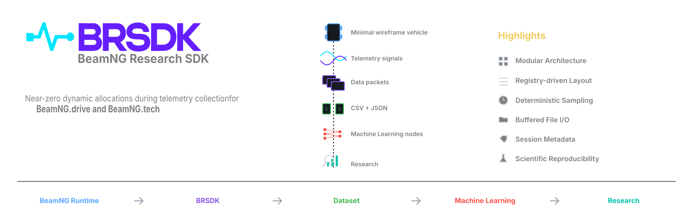
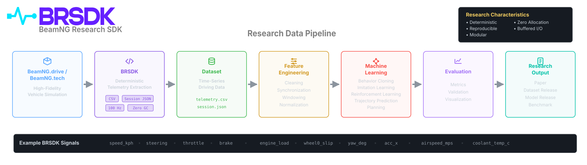
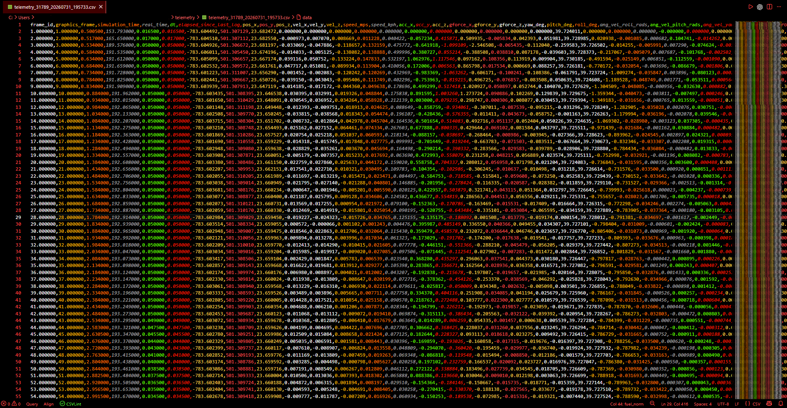
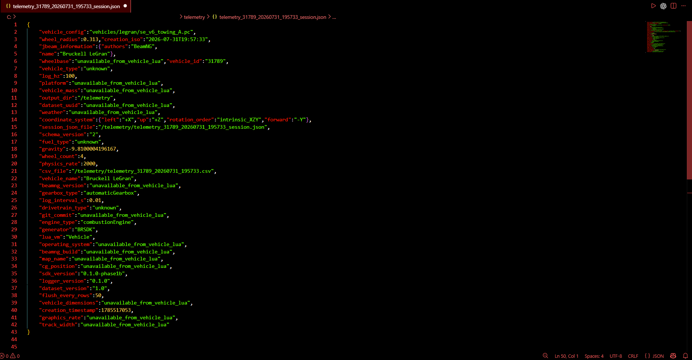

# BeamNG Research SDK (BRSDK)



[](https://opensource.org/licenses/Apache-2.0)
[]()
[]()
[]()
[](https://doi.org/10.5281/zenodo.21729606)

BRSDK is a deterministic, high-frequency telemetry framework and scientific Python SDK designed to bridge the **Simulation-to-Real (Sim2Real)** gap in autonomous driving, reinforcement learning, and vehicle dynamics research within **BeamNG.drive** and **BeamNG.tech**.

## Background and Motivation
A major challenge in autonomous vehicle control and reinforcement learning is the **Sim2Real reality gap**: neural controllers and state estimators trained on simulated telemetry often fail when deployed to physical hardware. Traditional simulators rely on rigid-body physics approximations or downsample telemetry to 20–50 Hz over network sockets, discarding sub-millisecond transient dynamics such as dynamic tire slip breakaway, suspension damper compression velocities, and chassis flex.

BeamNG resolves vehicle components as 2,000 Hz soft-body spring-mass lattices, providing real-world physical fidelity. However, standard in-engine logging introduces garbage collection (GC) pauses and dropped frames that distort training trajectories. 

**BRSDK solves this data acquisition bottleneck**: operating directly within the 2,000 Hz Vehicle Lua physics thread with zero dynamic memory allocations, BRSDK exports continuous ground-truth physical states alongside provenance metadata, enabling machine learning models to learn physical invariants that transfer reliably to real-world vehicles.

## Key Features
- **Sim2Real Physical Fidelity**: Captures 2,000 Hz soft-body dynamics (tire slip energy, suspension travel/velocities, wheel loads) to train controllers capable of transferring to physical platforms.
- **Zero-Allocation In-Engine Logging**: Samples high-frequency signals with zero dynamic Lua heap allocations during collection, preserving deterministic physics stepping without garbage collector pauses.
- **Orthogonal Domain Modules**: Modular telemetry architecture covering kinematics, orientation, powertrain, thermals, wheels, suspension, damage, and environment.
- **Configurable Layout Engine**: Supports backward-compatible legacy CSV schemas and ordered research layouts.
- **JSON Metadata Sidecars**: Every dataset includes an RFC 8259 `session.json` containing vehicle physics constraints, map parameters, and game versions.
- **Python ML Integration**: Direct export to Apache Arrow columnar memory, Polars, and PyTorch (via DLPack) for offline reinforcement learning (Minari) and system identification.

## Architecture Overview
BRSDK is built on a separation of concerns, operating primarily within the 2000Hz Vehicle Lua physics thread to preserve simulation fidelity:
- **Modules**: Perform high-frequency read-only queries against BeamNG APIs.
- **Registry**: The canonical registry for signal metadata, units, and data types.
- **Layout Engine**: Formats dynamic module signals into an ordered array.
- **Logger**: An I/O orchestrator that writes buffered records to disk via the Virtual File System (VFS).

For full details, see [ARCHITECTURE.md](docs/ARCHITECTURE.md).

## Research Data Pipeline



## Installation

BRSDK supports both **BeamNG.drive** (simulation) and **BeamNG.tech** (research platform).

1. Download the latest `BRSDK_v2.0.0.zip` release.
2. Extract the contents into your BeamNG user folder:
   - *BeamNG.drive*: `C:\Users\YourUser\AppData\Local\BeamNG.drive\0.32\mods\unpacked\BRSDK\`
   - *BeamNG.tech*: `C:\Users\YourUser\AppData\Local\BeamNG.tech\0.32\mods\unpacked\BRSDK\`
3. **Critical Folder Structure**: Your extracted mod folder MUST contain both the `lua/` and `scripts/` directories at the root level.
   - `scripts/`: Contains `modScript.lua`. BeamNG's engine automatically discovers files named `modScript.lua` during mod mounting to initialize the GameEngine extension.
   - `lua/`: Contains the actual telemetry payload (`lua/vehicle/extensions/brsdk/`). Without this, the vehicle will have no modules to load.

**How it loads:**
1. BeamNG discovers `scripts/telemetryLogger/modScript.lua` and executes it.
2. `modScript.lua` loads `lua/ge/extensions/telemetryLoggerGE.lua` into the GameEngine VM.
3. `telemetryLoggerGE` observes when a vehicle spawns and uses `queueLuaCommand` to inject the high-frequency logger directly into the sandboxed Vehicle Lua VM.

*Note: The `lua/` directory must not be placed directly in the user folder root; it must reside within an unpacked mod directory to allow `modScript.lua` to initialize.*

## Quick Start
1. Launch BeamNG and load any map and vehicle.
2. The logger will automatically mount and begin recording.
3. Drive the vehicle to generate telemetry.
4. Close the game or reset the vehicle to finalize the files.
5. Retrieve your datasets from the expected output folder: `[BeamNG User Path]/0.32/telemetry/`.

## Output Examples

**Expected CSV Output:** (`telemetry_[ID]_[TIMESTAMP].csv`)


**Expected JSON Output:** (`telemetry_[ID]_[TIMESTAMP]_session.json`)


## Documentation
Technical documentation and references:
- [Python SDK (`brsdk`)](python/README.md)
- [API Reference](docs/API_REFERENCE.md)
- [Signal Reference](docs/SIGNAL_REFERENCE.md)
- [Dataset Specification](docs/DATASET_SPECIFICATION.md)
- [Reproducibility Guide](docs/REPRODUCIBILITY.md)

## Citation
If you use BRSDK in your published research, please cite it using the provided `CITATION.cff` file, or via the following BibTeX:
```bibtex
@software{gangwar2026brsdk,
  author  = {Kartikeya Gangwar},
  title   = {BeamNG Research SDK (BRSDK)},
  year    = {2026},
  version = {2.0.0},
  url     = {https://github.com/KartikeyaGangwar/BRSDK},
  license = {Apache-2.0},
  doi     = {10.5281/zenodo.21729606}
}
```
The preferred citation is automatically available through GitHub's
"Cite this repository" feature using the included CITATION.cff file.

## License
BRSDK is released under the **Apache License 2.0**. See the [LICENSE](LICENSE) file for more details.

## Contributing
Please see [CONTRIBUTING.md](CONTRIBUTING.md) and our [CODE_OF_CONDUCT.md](CODE_OF_CONDUCT.md) for details on submitting pull requests and reporting issues.

## Acknowledgements
The author acknowledges the BeamNG developers and research community for software support and feedback.
