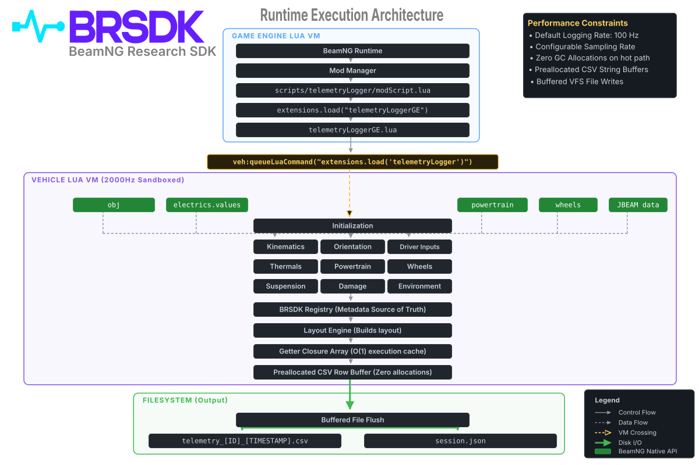

# BRSDK Architecture

The BeamNG Research SDK (BRSDK) employs an orthogonal, module-based architecture designed specifically to achieve near-zero allocation data extraction within the high-frequency BeamNG Vehicle Lua physics thread.

## Core Philosophy
1. **Near-zero Allocation on the Hot Path**: The 2000Hz physics thread must not trigger the Lua Garbage Collector. All tables, buffers, and state dictionaries are pre-allocated during initialization. The `collectRow` loop contains strictly `O(1)` operations and bypasses closure creation or table concatenation.
2. **Orthogonality**: Telemetry signals are isolated into domain-specific modules (e.g., `kinematics`, `powertrain`). Modules do not communicate with each other.
3. **Decoupled Layout**: The core logger relies entirely on the `Layout Engine` to dictate the order of exported signals, enabling backward compatibility and schema elasticity.

## System Components

### 1. The Logger (`telemetryLogger.lua`)
The logger is the system orchestrator. It performs three primary duties:
- Hooks into the `updateGFX` BeamNG callback.
- Triggers all modules to `update()` their internal state.
- Iterates over an array of pre-cached getter closures (provided by the Layout Engine), writes the results into a pre-allocated array buffer, and flushes the buffer to disk.

### 2. Domain Modules (`brsdk/modules/*`)
Each module represents a discrete physical domain. See the [API Reference](API_REFERENCE.md) for module structure.
- **`initialize()`**: Pre-allocates internal state tables to avoid dynamic GC allocation.
- **`update(dt)`**: Performs read-only queries against the BeamNG C++ API and updates internal properties.
- **`registerSignals(registry)`**: Appends the module's signals into the centralized Registry.

### 3. The Registry (`brsdk/core/registry.lua`)
The Registry is the metadata source of truth. It stores information about every signal, including:
- Names, descriptions, units, and logical categories.
- Getter functions pointing back to the specific domain module.
- For a full list of registered signals, see the [Signal Reference](SIGNAL_REFERENCE.md).

### 4. Layout Engine (`brsdk/layout/layoutEngine.lua`)
The Layout Engine defines the sequence in which columns appear in the output dataset.
- It provides formats such as `legacy_csv` (byte-for-byte backward compatible with older scripts). See the [Dataset Specification](DATASET_SPECIFICATION.md).
- During initialization, the logger requests an ordered layout array and caches getter functions for `O(1)` runtime extraction.

## Data Flow Diagram

1. **Init**: Logger calls `module.registerSignals(registry)` -> Registry populated.
2. **Init**: Logger requests `legacy_csv` layout from Layout Engine.
3. **Runtime**: Logger calls `update()` on modules. Modules fetch from C++ API.
4. **Runtime**: Logger iterates the cached layout closures to fetch state.
5. **Runtime**: Logger flushes to telemetry dataset.
