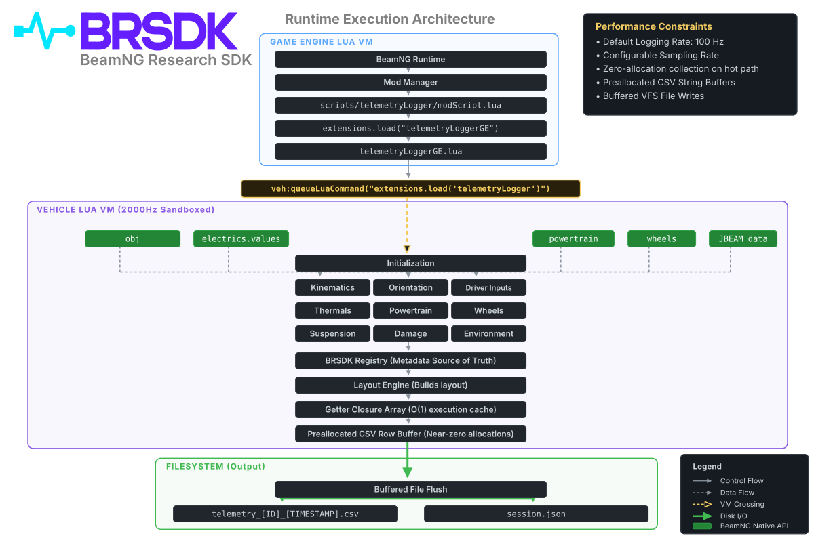

# Summary

A persistent challenge in robotics, autonomous vehicle engineering, and reinforcement learning is the simulation-to-real (Sim2Real) transfer gap: control policies and predictive neural networks trained in simulated environments frequently fail or exhibit instability when deployed on physical vehicles. A primary contributor to this reality gap is the omission or temporal downsampling of high-frequency, non-linear transient dynamics—such as tire slip stick-slip transitions, dynamic suspension damper velocities, structural chassis compliance, and wheel hop—in standard simulation telemetry pipelines.

BeamNG.drive and the research environment BeamNG.tech provide a soft-body dynamics physics engine that resolves vehicle components as spring-mass lattices at 2,000 Hz [@BeamNG:2020]. This mechanical fidelity enables realistic modeling of tire contact patch deformation, chassis torsion, and non-linear suspension dynamics. However, capturing these high-frequency states without degrading the real-time simulation loop presents significant engineering hurdles.

The BeamNG Research SDK (`BRSDK`) is an open-source, dual-runtime framework engineered to extract, serialize, validate, and analyze deterministic vehicle physics from BeamNG to accelerate Sim2Real research. It operates directly within the 2,000 Hz sandboxed Vehicle Lua Virtual Machine (VM) using pre-allocated memory buffers to eliminate dynamic memory allocations in the physics callback, preventing garbage collection latency spikes from degrading simulation determinism. Downstream, `BRSDK` pairs each telemetry recording with an RFC 8259 JSON metadata sidecar and provides a typed Python library (`brsdk`) backed by Apache Arrow columnar memory and the Polars query engine [@Arrow:2024; @Vink:2024].

# Statement of need

Bridging the Sim2Real gap requires training machine learning models on physical state observations that accurately reflect the continuous dynamics of physical hardware [@Towers:2023]. In BeamNG, vehicle-side code executes inside a Just-In-Time (JIT) compiled Lua VM [@Ierusalimschy:2007]. Conventional data logging approaches within Lua typically construct dynamic tables, strings, and closures inside each frame callback. In a 2,000 Hz physics loop, these operations accumulate uncollected allocations on the Lua heap, triggering periodic garbage collector pauses. These pauses introduce non-deterministic frame stepping, missed samples, and sampling jitter, injecting artificial timing artifacts into the training data that undermine Sim2Real policy robustness.

Furthermore, existing tools lack unified provenance metadata. Telemetry files frequently omit structural vehicle parameters (such as curb mass, component configurations, center-of-gravity offsets, and wheel dimensions) necessary to interpret raw kinematic arrays. Post-processing has historically relied on ad-hoc scripts that parse unstructured comma-separated value (CSV) files with ambiguous data types and undocumented null values.

`BRSDK` addresses these challenges by providing:

1. **Zero dynamic heap allocations** during real-time data extraction in Lua, preserving physics determinism, consistent sample timing, and sub-millisecond physical fidelity.
2. **Standardized metadata sidecars** (`session.json`) capturing vehicle configuration parameters, environment variables, and simulation provenance necessary for reproducible Sim2Real model evaluation.
3. **A typed Python scientific library** implementing Pydantic V2 schema validation and Apache Arrow / Polars columnar structures for direct zero-copy integration with numerical workflows and machine learning frameworks.

# State of the field

Researchers developing autonomous driving and vehicle control systems have traditionally chosen between high-level autonomous driving platforms and real-time rigid-body engines:

- **CARLA** [@Dosovitskiy:2017] and **AirSim** [@Shah:2018] provide extensive sensor suites and urban environments, but rely primarily on simplified rigid-body vehicle dynamics (such as PhysX). These engines do not model structural chassis compliance, tire thermal degradation, or component deformation under handling limits, inducing substantial Sim2Real domain shift when transferring controllers to physical platforms.
- **BeamNG-py** provides a Python interface for orchestrating scenarios and interacting with BeamNG.tech via TCP network sockets. However, transferring telemetry over inter-process network sockets introduces latency and bandwidth constraints that limit extraction frequencies to lower rates (typically 10–50 Hz). This subsampling discards transient high-frequency dynamics such as wheel hop, ABS pressure modulation, and suspension damping velocities, which are vital for training controllers intended for physical deployment.

`BRSDK` addresses high-frequency telemetry extraction by operating directly within the vehicle simulation thread. Rather than replacing client-server scenario orchestrators, `BRSDK` functions as an in-engine instrumentation layer: it extracts state natively within the Vehicle VM at 2,000 Hz and writes buffered records directly to the local filesystem, avoiding socket transmission overhead and preserving the physical phenomena required for Sim2Real generalization.

# Software design

The architecture of `BRSDK` is split across two execution environments: the high-frequency vehicle simulation runtime (Lua) and the analytical post-processing environment (Python).

## In-Engine Telemetry Pipeline (Lua)

In BeamNG, execution is isolated across two distinct virtual machines: the Game Engine (GE) VM and the Vehicle VM. The Vehicle VM executes within the 2,000 Hz physics loop but is strictly sandboxed from game engine APIs (e.g., world level names or rendering states). `BRSDK` orchestrates collection across these runtimes:

1. **Bootstrap Phase**: A Game Engine extension (`telemetryLoggerGE.lua`) boots during mod mounting, monitors vehicle spawning, and injects the vehicle extension (`telemetryLogger.lua`) into the Vehicle VM via `queueLuaCommand`.
2. **Decoupled Modular Architecture**: Signal extraction is partitioned into isolated domain modules (`kinematics`, `orientation`, `driverInputs`, `powertrain`, `thermals`, `suspension`, `wheels`, `damage`, and `environment`). Each module pre-allocates static state buffers during initialization.
3. **Signal Registry and Layout Engine**: Modules register metadata (signal name, unit, physical type, category) with a central `Registry`. The `Layout Engine` orders these signals into pre-compiled closure arrays for $O(1)$ row evaluation during `updateGFX`.
4. **Pre-Allocated Buffer Serialization**: Dynamic string concatenations and table instantiations (`{}`) are eliminated in the collection callback. Values are formatted directly into pre-allocated memory buffers flushed periodically to disk, avoiding garbage collection pauses.

As illustrated in \autoref{fig:architecture}, signal collection is decoupled across the real-time simulation thread and the analytical Python environment.

{ width=95% }

## Python Scientific SDK (`brsdk`)

The Python SDK (`python/src/brsdk`) reads, validates, and models the exported telemetry datasets:

- **Immutability & Columnar Representation**: Built in accordance with RFC-0001, the `Dataset` class serves as a container binding a `polars.DataFrame` to a validated `SessionMetadata` model. Polars utilizes Apache Arrow columnar memory internally, enabling multi-threaded queries and zero-copy data exchange with NumPy [@Harris:2020] and PyTorch tensors via DLPack for neural network training.
- **Metadata Validation and Schemas**: Sidecar JSON files are parsed through Pydantic V2 models (`SessionMetadata`, `SimulationMetadata`, `VehicleMetadata`, `SDKMetadata`) [@Pydantic:2024]. Fields inaccessible from the sandboxed Vehicle Lua VM (such as map identifiers or global engine versions) are handled through explicit sentinels (`"unavailable_from_vehicle_lua"`), ensuring schema validation without rejecting valid experimental sessions.

# Research impact statement

`BRSDK` provides reproducible data infrastructure for research in vehicle dynamics, tire friction estimation, and autonomous control, specifically targeting Sim2Real transfer:

- **Sim2Real Machine Learning & Offline RL**: Facilitates the export of continuous, sub-millisecond state-transition trajectories into Minari and PyTorch formats. By capturing real physics phenomena (such as tire slip energy and damper response rates) that conventional simulators smooth away, policies trained on `BRSDK` datasets maintain stability under real-world physical deployment.
- **Empirical Validation**: Evaluated across continuous BeamNG simulation sessions exceeding 490,000 samples across 86 continuous physical signals per session without memory growth and with consistent sub-millisecond recording intervals.
- **Non-Linear System Identification**: Enables extraction of suspension compression velocities and dynamic tire slip energy profiles that are inaccessible through default simulation telemetry interfaces, facilitating the identification of non-linear vehicle parameters.
- **Reproducible Data Sharing**: By pairing raw signal arrays with immutable `session.json` sidecars capturing vehicle geometry, mass properties, and simulator builds, datasets generated via `BRSDK` meet Open Science standards for archival and benchmark publishing.

# AI usage disclosure

Generative artificial intelligence tools (Anthropic Claude and Google Gemini) were used during the development of this software for tasks including unit test scaffolding, documentation cross-linking, formatting verification, and drafting portions of the technical text. All software architecture, physics modeling, algorithmic implementations, and experimental verifications were directed, reviewed, validated, and finalized by the human author, who assumes full responsibility for the contents of the software and manuscript.

# Acknowledgements

The author acknowledges BeamNG GmbH for developing the BeamNG simulation platform and supporting academic vehicle dynamics simulation.

# References
